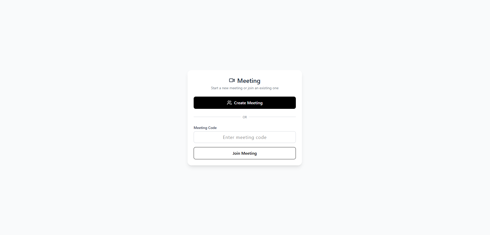
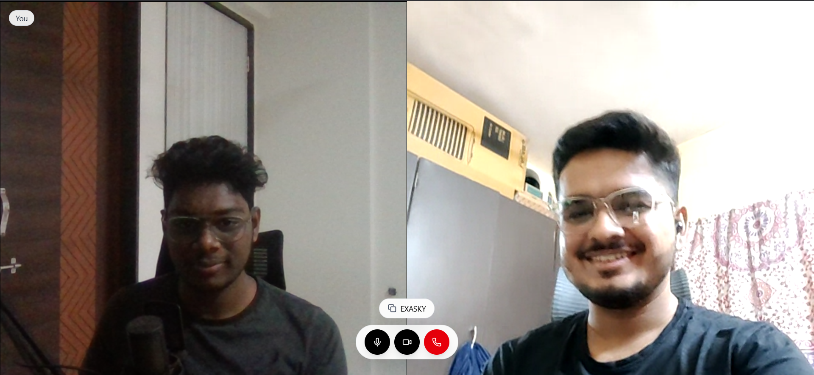
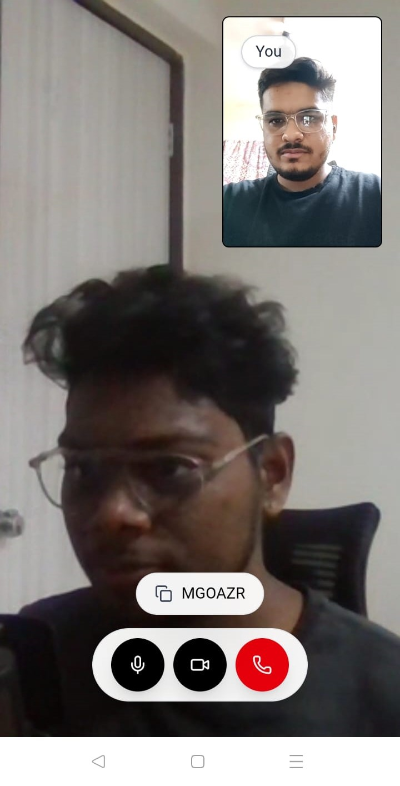
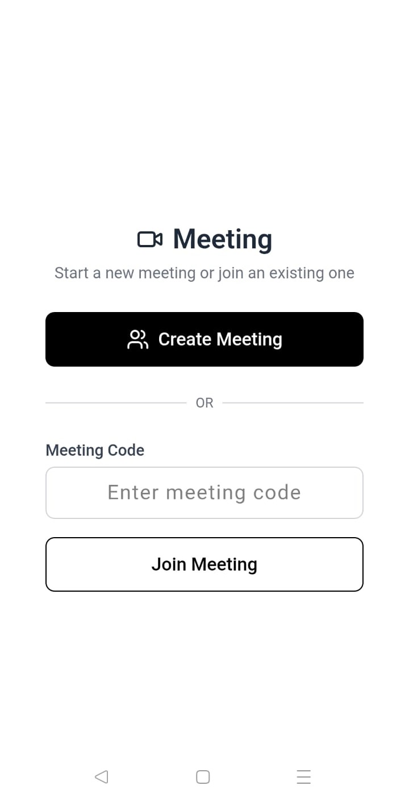
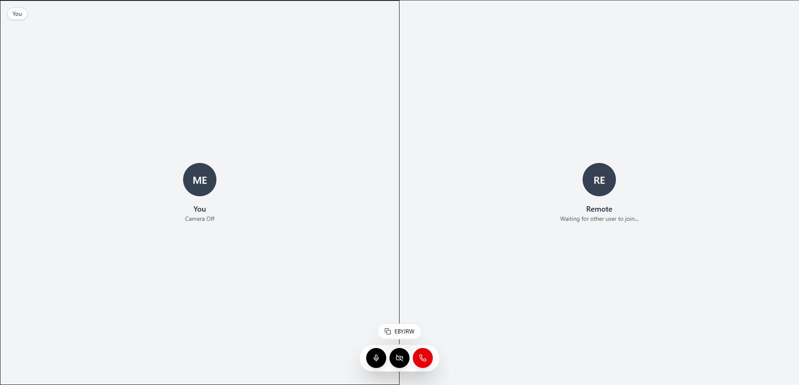
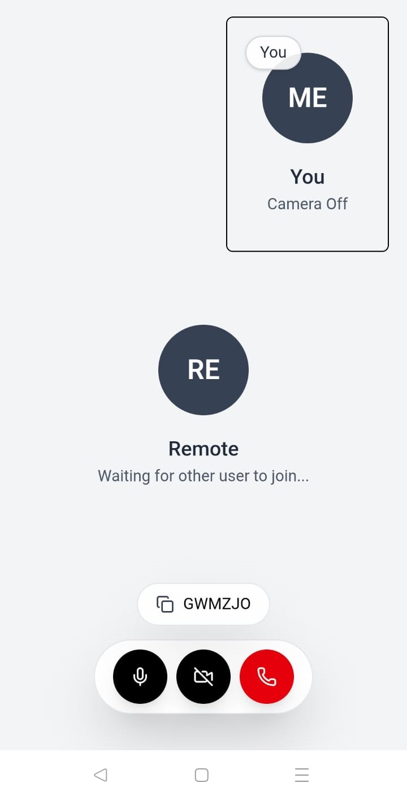
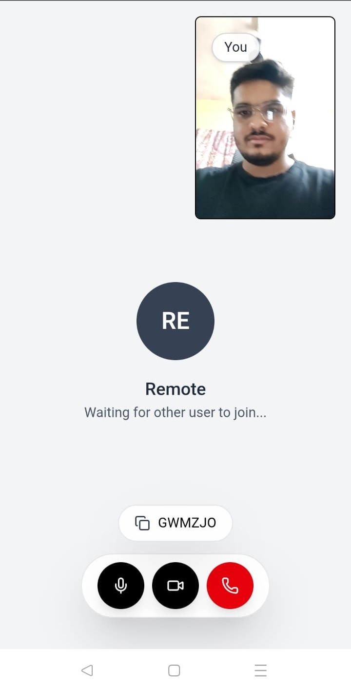

# 🔗 Video Call App

A simple peer-to-peer video calling web app where users can **create or join a meeting** using a code. Built using **React** for the frontend and **Node.js + WebRTC** for the backend. Designed for **1-on-1 private meetings**, with intuitive controls and secure HTTPS support for production.

## 🚀 Features

- ✅ Create a new video meeting
- ✅ Join an existing meeting via unique code
- ✅ 1-on-1 video call support (maximum 2 participants)
- 🎤 Toggle microphone on/off
- 🎥 Toggle camera on/off
- 🔐 Secure connection (HTTPS required for production)
- 🌐 Works across long distances (tested 233 km apart!)
- ⚡ Smooth and low-latency video call experience

---

## 🏗️ Production Setup

To deploy the app for production:

1. **Build the React Frontend**

   ```bash
   cd client
   npm run build
   ```

2. **Move the Build to Backend**
   Copy the contents of `client/build` to the `server/public` folder.

3. **Setup HTTPS (Required for WebRTC)**

   - Use **HTTPS** only; WebRTC won’t work on unsecured HTTP.
   - You can:

     - Use **Let's Encrypt** for a valid SSL cert
     - OR for testing, use **self-signed certificates**

4. **Self-Hosting Notes**

   - I personally hosted the backend on a **self-hosted Ubuntu server**.
   - I used **self-signed certificates** to enable HTTPS.
   - The app was tested with a friend **233 km away** — it worked flawlessly.

---

## 📸 Screenshots (Me)

| Create or Join a Meeting                     | In-Call Controls                        |
| -------------------------------------------- | --------------------------------------- |
|  |  |

## 📸 Screenshots ([Friend](https://github.com/yasinbhojani))

| Create or Join a Meeting                | In-Call Controls                 |
| --------------------------------------- | -------------------------------- |
|  |  |

## 📸 Extra Screenshots

| Description       | Screenshot                              |
| ----------------- | --------------------------------------- |
| Additional View 1 |  |
| Additional View 2 |         |
| Additional View 3 |         |

---

# 📹 WebRTC

## 📄 Overview

WebRTC allows real-time video/audio communication **directly between browsers** without plugins. It uses **peer-to-peer** connections and needs some setup to work reliably across networks.

---

## ✅ Requirements Checklist

### 🔐 HTTPS (SSL Certificate)

- Required in production.
- Use **Let’s Encrypt** (free).
- Needed to access camera/mic (`getUserMedia()`).

---

### 📡 STUN Server (Always Needed)

- Helps clients discover their public IP.
- Use public STUN like:

  ```
  stun:stun.l.google.com:19302
  ```

---

### 🔄 TURN Server (Required for Production)

- Relays media if direct connection fails.
- Needed when users are behind firewalls or symmetric NAT.
- Use `coturn` or a paid service (Twilio, Xirsys, etc.).

---

### 🧩 Signaling Server (Socket.IO)

- Exchanges connection info (offer, answer, ICE candidates).
- Can be built using **Socket.IO** or WebSocket.

---

### 🎥 getUserMedia Support

- Used to capture webcam and mic.
- Example:

  ```js
  navigator.mediaDevices.getUserMedia({ video: true, audio: true });
  ```

---

### 🔗 RTCPeerConnection Setup

- Core WebRTC API.
- Handles connection, streaming, ICE exchange.

---

### 🌐 Network Port Configuration (for TURN)

- Open ports:

  - `3478` for TURN
  - `49152–65535/udp` for relay traffic

- Required if you're self-hosting TURN (coturn).

---

## 🧠 Visual Flow

```
[Caller]                                  [Receiver]
   |                                          |
 getUserMedia()                         getUserMedia()
   |                                          |
createOffer() -----------------------> setRemoteDescription()
   |                                          |
setLocalDescription()                 createAnswer()
   |                                          |
Send offer via signaling ---------> Send answer via signaling
   |                                          |
Exchange ICE candidates via signaling
   |                                          |
RTCPeerConnection connects (STUN/TURN if needed)
   |                                          |
video/audio flows <------------------> video/audio flows
```

---

## 📦 WebRTC Flow Summary (John & Jack)

Assume:

- John **initiates** the video call
- Jack **receives** and answers the call

---

### 🔹 Step-by-Step Flow

1. **John opens the app**

   - Browser asks for **camera/mic access**
   - John allows → `getUserMedia()` gives John’s video stream

2. **John creates a peer connection**

   - Adds his video stream to `RTCPeerConnection`
   - Calls `createOffer()`
   - Sets the offer as `localDescription`

3. **John sends offer to Jack** (via signaling server like Socket.IO)

---

4. **Jack receives the offer**

   - Allows camera/mic → `getUserMedia()` gives Jack’s stream
   - Creates his own `RTCPeerConnection`
   - Adds his video stream
   - Sets John’s offer as `remoteDescription`
   - Calls `createAnswer()`
   - Sets it as `localDescription`

5. **Jack sends answer back to John** (via signaling)

---

6. **Both exchange ICE candidates**

   - These help browsers discover paths to connect (via STUN or TURN)
   - ICE candidates are sent via the signaling server

---

7. **Connection Established**

   - WebRTC finds the best path (peer-to-peer or via TURN)
   - Both call `ontrack` to receive the remote stream
   - Now **John sees Jack**, and **Jack sees John**

---

## 🧠 In Short:

| Person | Step                                                              |
| ------ | ----------------------------------------------------------------- |
| John   | `getUserMedia()` → `createOffer()` → send offer                   |
| Jack   | `getUserMedia()` → receive offer → `createAnswer()` → send answer |
| Both   | Exchange ICE → Peer connection → Stream video/audio               |
